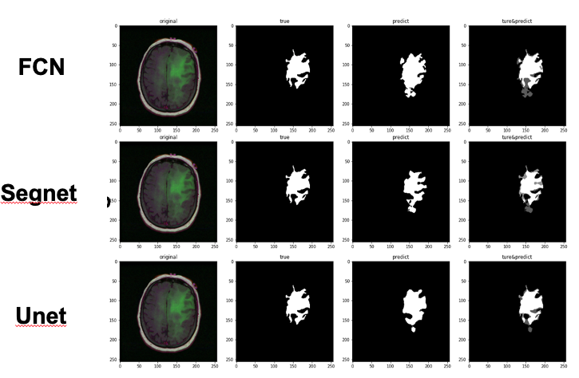
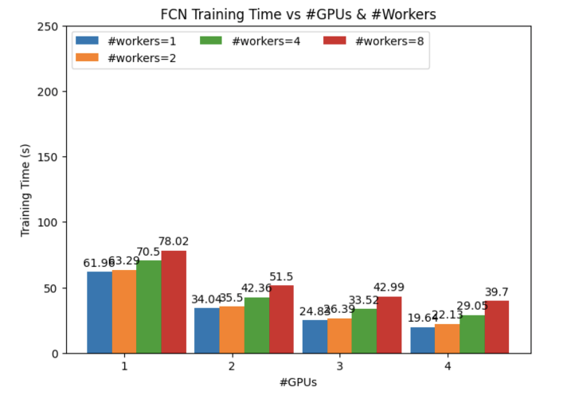
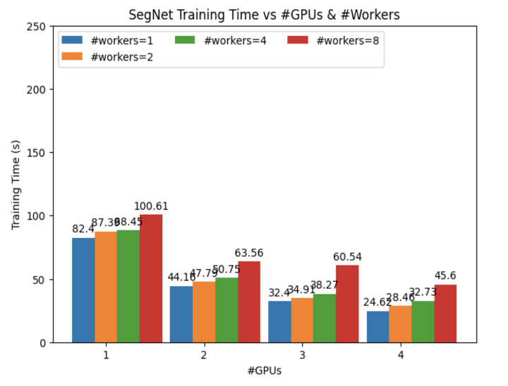

# HPML_project_lgg_mri_segmentation

Banani Ghosh (bg2502)

## A description of the project
The aim of this project is to compare different optimization techniques used in image segmentation models like FCN, Unet, Segnet, etc. The objective is to identify precise and efficient models for segmenting medical images from datasets.

## Code structure
```
├── FCN                     // fcn model
├── Segnet                  // segnet model
├── Unet                    // unet model
├── lgg-mri-segmentation    // dataset
├── result                  // result
```

## Commands to execute the code        
run this script in NYU HPC
you need modified the dataset dir in the model code
```
#!/bin/bash

#SBATCH --cpus-per-task=4
#SBATCH --time=2:00:00
#SBATCH --mem=64GB
#SBATCH --gres=gpu:4
#SBATCH --job-name=torch
#SBATCH --output="%A\_%x.txt"
#SBATCH --account=ece_gy_9143-2024sp
#SBATCH --partition=n1c24m128-v100-4

echo "GPU: $(nvidia-smi -q | grep 'Product Name')"

singularity exec --nv \
	    --overlay /scratch/bg2502/pytorch-example/my_pytorch.ext3:ro \
	    /share/apps/images/cuda11.6.124-cudnn8.4.0.27-devel-ubuntu20.04.4.sif\
	    /bin/bash -c "source /ext3/env.sh; python fcn.py"
```

## Results
### base model

| Network | MIoU   |
|---------|--------|
| FCN     | 80.95% |
| U-Net   | 83.40% |
| SegNet  | 78.02% |

### optimization





- Employing DistributedDataParallel for training across multiple GPUs significantly reduces training time for all three models.
- With 0 workers in the DataLoader, training time is halved when utilizing 2 GPUs; however, from 2 to 4 GPUs, training time increases substantially.
- The training time for all 3 models diminishes with an increase in the number of GPUs when the number of workers in the DataLoader is not set to zero.
- Conversely, the training time for all 3 models rises as the number of workers in the DataLoader increases.


DistributedDataParallel facilitates the parallelization of model training across multiple GPUs, offering a significant reduction in training time for extensive models and datasets.

By default, when num_workers is set to 0, data loading occurs within the main process, potentially impeding training as the GPU might be left waiting for data to be loaded before proceeding to the next iteration.

However, when num_workers is set to a value greater than 0, multiple subprocesses engage in loading data in parallel. This enables the GPU to process one batch of data while a worker process loads the next, minimizing or eliminating the GPU's idle time and thus accelerating training.

It's important to note that each worker process consumes CPU memory, and there's overhead in coordinating between these processes. Setting num_workers too high may actually hinder data loading performance or result in out-of-memory errors.
